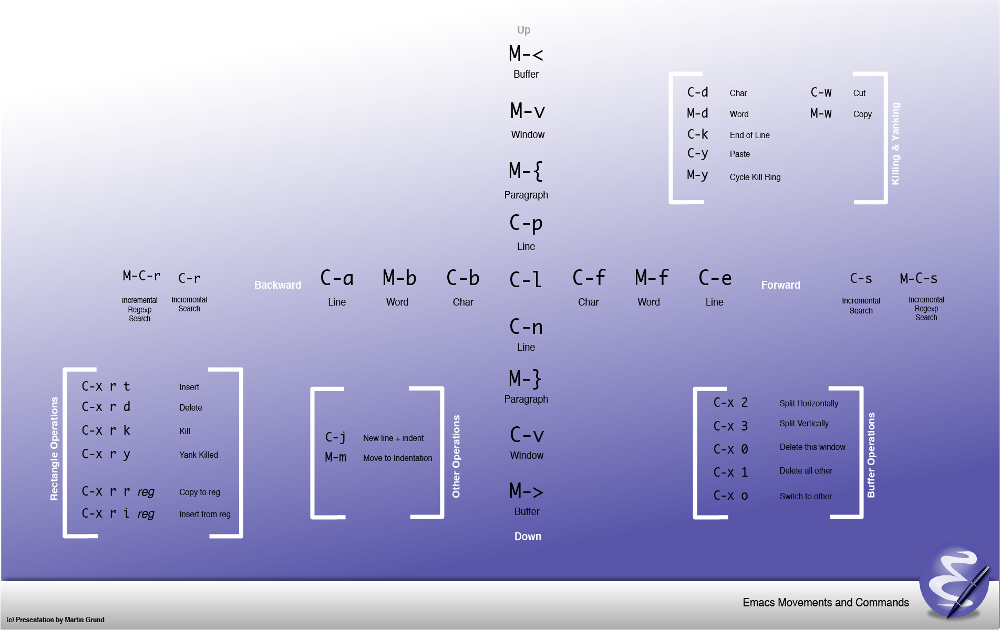

# 기본 조작법

**`Ctrl-G`** 중요합니다.

| 키       | 기호                       |
| -------- | -------------------------- |
| Ctrl     | C-                         |
| Meta     | M-                         |
| Super    | S-                         |
| Hyper    | H-                         |
| Enter    | RET                        |
| Space    | SPC                        |
| F1       | <f1>                       |
| 상하좌우 | <up>/<down>/<left>/<right> |
| 마우스   | <mouse-1>                  |

## 필수 조작법

| 필수               | 단축키     |
| ------------------ | ---------- |
| **중단**           | `C-g`      |
| 파일 열기          | C-x C-f    |
| 저장하기           | C-x C-s    |
| 저장하기(다른이름) | C-x C-w    |
| 종료               | C-x C-c    |
| 명령어 실행        | M-x 명령어 |


## 이동

| C-이동                 | 단축키 | M-이동           | 단축키       |
| ---------------------- | ------ | ---------------- | ------------ |
| 문자 앞(forward)       | C-f    | 단어 앞(forward) | M-f          |
| 문자 뒤(back)          | C-b    | 단어 뒤(back)    | M-b          |
| 라인 위(previous-line) | C-p    |                  |              |
| 라인 아래(next-line)   | C-n    |                  |              |
| 라인 앞                | C-a    | 문단 앞          | M-a          |
| 라인 뒤                | C-e    | 문단 뒤          | M-e          |
|                        |        | 라인으로 이동    | M-g M-g 라인 |

[](../res/emacs-movement.png)
- [출처](https://punchcard.wordpress.com/2010/10/09/emacs-movement-shortcuts-wallpaper/)

## 튜토리얼 시작

위에 필수과 이동을 잘 숙지 후,  `M-x help-with-tutorial-spec-language`후 `Korean`을 입력하시면 한글로 튜토리얼을 볼 수 있습니다.

## 기타

### 삭제

| 이동             | 단축키                         | 이동             | 단축키    |
| ---------------- | ------------------------------ | ---------------- | --------- |
| C-k              | 현재 커서에서 라인 끝까지 삭제 | M-k              | 버퍼 삭제 |
| 이전 문자 지우기 | `<Del>`                        | 이전 단어 지우기 | M-`<Del>` |
| 다음 문자 지우기 | C-d                            | 다음 단어 지우기 | M-d       |

### 복사, 붙여넣기, 되돌리기

| 복사, 붙여넣기, 되돌리기 | 단축키    |
| ------------------------ | --------- |
| 마크: 설정               | C-`<SPC>` |
| 마크: 전체               | C-x h     |
| 마크: `복사`             | M-w       |
| 마크: `잘라내기`         | C-w       |
| `붙여넣기`               | C-y       |
| `되돌리기`               | C-x u     |
| `되돌리기`               | C-/       |

### 확대축소

| 확대축소              | 단축키    |                       |
| --------------------- | --------- | --------------------- |
| 확대                  | C-x C-`-` |                       |
| 축소                  | C-x C-`=` |                       |
| 자동줄바꿈(껏다 켰다) | C-x x t   | toggle-truncate-lines |

### 검색

| 검색               | 단축키 |
| ------------------ | ------ |
| 정방향             | C-s    |
| 역방향             | C-r    |
| 정방향(정규표현식) | C-M-s  |
| 역방향(정규표현식) | C-M-r  |
| 바꾸기             | M-%    |
| 바꾸기(정규표현식) | C-M-%  |

### 헬프

- ref: <https://www.gnu.org/software/emacs/manual/html_node/emacs/Key-Help.html>

| 설명                             | 단축키                | 함수                 |
| -------------------------------- | --------------------- | -------------------- |
| 정보보기                         | C-h i                 | info                 |
| 키 확인(간단히)                  | C-h c                 | describe-key-briefly |
| 키 확인(자세히)                  | C-h k                 | describe-key         |
| 최근에 입력한 키 보기            | C-h l   혹은 <f1> l   |                      |
| 단축키 보기(모두)                | C-h b                 |                      |
| 단축키 보기(C-x로 시작하는 것만) | C-x C-h 혹은 C-x <f1> |                      |
| 단축키 보기(사용자 정의)         | C-c C-h 혹은 C-c <f1> |                      |
  
- `C-h i m Elisp RET` : [GNU Emacs Lisp Reference Manual](https://www.gnu.org/software/emacs/manual/elisp.html)
- `C-h i m Emacs Lisp Intro RET` : [An Introduction to Programming in Emacs Lisp](https://www.gnu.org/software/emacs/manual/eintr.html)

## shell

- <https://unix.stackexchange.com/a/180129>
  - M-x shell
    - {grep, du, ls, sort, cat, head, tail, uname, ...}와 같은 클래식/표준 Unix 쉘 명령의 일반적인 사용에 적합합니다.
  - M-x term ＆ M-x ansi-term
    - ssh나 기타 명령줄 대화형 인터페이스(예: {python, ruby, lisp} 셸) 또는 {vim, synaptic, …}과 같은 텍스트 기반 GUI 앱을 실행하려는 경우에 좋습니다.
  - M-x eshell
    - eshell은 emacs lisp에 직접 액세스할 수 있기 때문에 bash가 설치되지 않은 Microsoft Windows에서 특히 좋습니다. 또는 emacs lisp 프로그래머라면 더욱 좋습니다.

## 버퍼, 윈도우, 프레임, 탭

**버퍼**와 **윈도우**를 자주 사용합니다.

### 버퍼

| **버퍼**       | 단축키  |
| -------------- | ------- |
| 목록           | C-x C-b |
| 이동           | C-x b   |
| 삭제           | C-x k   |
| 읽기전용(토클) | C-x C-q |

### 윈도우

|                     | **윈도우** | 프레임    | 탭        |
| ------------------- | ---------- | --------- | --------- |
| 현재창 닫기         | C-x 0      | C-x 5 0   | C-x t 0   |
| 다른창 닫기         | C-x 1      | C-x 5 1   | C-x t 1   |
| 새로만들기          | C-x 2      | C-x 5 2   | C-x t 2   |
| 새로만들기(우측)    | C-x 3      |           |           |
| 다음으로 이동       | C-x o      | C-x 5 o   | C-x t o   |
| 파일 열기           | C-x C-f    | C-x 5 C-f | C-x t C-f |
| 파일 열기(읽기전용) | C-x C-r    | C-x 5 r   | C-x t C-r |

## 모드

- 주(매이져, Major)모드와 보조(마이너, Minor)모드가 있습니다.
  - `M-x describe-mode RET` 으로 확인 할 수 있습니다.

## 키고 끄기

모드를 키고 끄는건 `+1` 혹은 `-1`을 사용하도록 합니다.

``` lisp
(display-time-mode +1) ; 시간 켜기
(display-time-mode -1) ; 시간 끄기 (0포함 음수면 끄기)
```

### 예)

- elisp파일을 열고 `M-x prettify-symbols-mode RET`으로 한 다음,
- `M-x describe-mode RET`를 입력하면 매이저/마이너 모드를 확인 할 수 있습니다.
  - 매이저 ELisp/d는 elisp-mode.el 정의되어있고, 
  - 마이너 모드는 Auto-Save, Eldoc, Font-Lock, 그리고 아까 활성화시킨 Prettify-Symbols 가 활성되어있습니다.

``` lisp
;; emacs-lisp-mode는 lisp-data-mode를
;; lisp-data-mode는 prog-mode(programming mode)를
;; prog-mode는 fundamental-mode를 상속받고 있습니다.

;; emacs-lisp-mode
;;   -|> lisp-data-mode
;;     -|> prog-mode
;;       -|> fundamental-mode

;; 그리고 lisp-data-mode는 다음 prettify-symbols-alist를 가지고 있다.
;; alist란 association list(연관리스트)의 약자로, (key . value)의 리스트이다.
(defconst lisp-prettify-symbols-alist '(("lambda"  . ?λ))
  "Alist of symbol/\"pretty\" characters to be displayed.")

;; prettify-symbols-mode를 활성시켰으므로
;; emacs-lisp-mode인 .el파일에서 lambda를 입력하면 λ로 바뀐다.
```

## defun

`C-x f hello.el`로 초기화 파일을 열어봅시다.

|             |                                  |
| ----------- | -------------------------------- |
| defun       | 함수 정의                        |
| interactive | 함수를 `M-x`로 실행할 수 있게 함 |

``` lisp
;; init.el --- Emacs configuration
;; `C-M-x` 평가하기

;; 다음 함수를 작성하여 함수를 평가하여 정의합니다.
(defun hello ()
  (message "Hello World"))

;; 다음 폼(form)을 평가하면 하단에 "Hello World"가 출력됩니다.
(hello)

;; (interactive)를 추가하면, `M-x hello`로 함수를 실행할 수 있습니다.
(defun hello ()
  (interactive)
  (message "Hello World"))
```


## 참고

- [TUTORIAL.ko](https://github.com/emacs-mirror/emacs/blob/master/etc/tutorials/TUTORIAL.ko)
- [emacs: wiki](https://www.emacswiki.org/)
- [emacs(영문): 메뉴얼](https://www.gnu.org/software/emacs/manual/)
- [emacs(영문): 투어](https://www.gnu.org/software/emacs/tour/)
